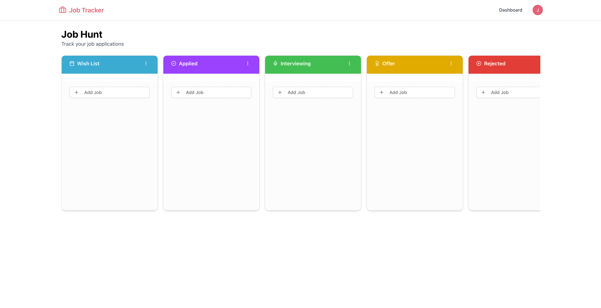
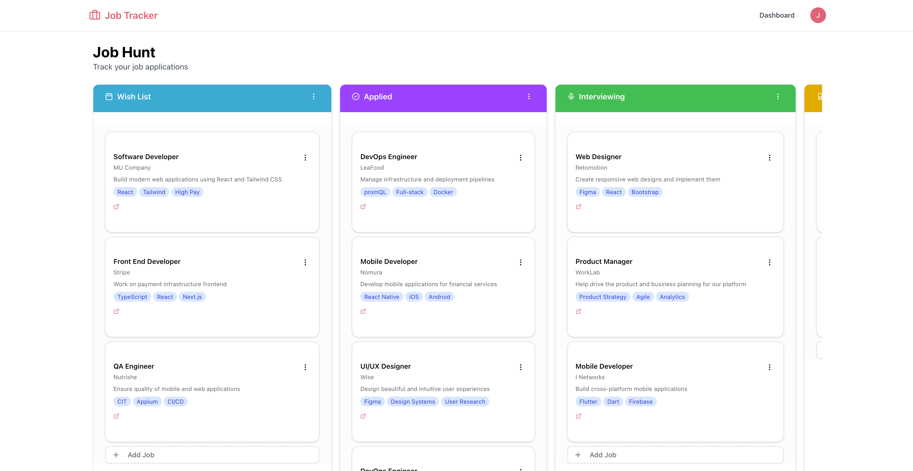

# 🧑‍💼 Jobify

A modern web application built with Next.js designed to managing and tracking job applications in one place.

🔗 **[Live Demo Link](https://your-demo-link.com)**

---

## 📸 Preview





---

## ✨ Features

* **Responsive Design:** Fully optimized for mobile, tablet, and desktop viewports.
* **Drag & Drop:** Easily move job applications between column.
* **Component Library:** Styled using Tailwind CSS & Shadcn for a polished UI.
* **State Management & Data Fetching:** Optimized caching and server-state synchronization.

---

## 🛠️ Tech Stack

| Category | Technology |
| :--- | :--- |
| **Framework/Library** | React 19 / Next.js 16 |
| **Authentication** | BetterAuth |
| **Styling** | Tailwind CSS / shadcn |
| **State Management** | useHook |
| **Database** | MongoDB |
| **ORM / ODM** | Mongoose |

---

## ⚙️ Getting Started

Follow these steps to set up the entire project locally.

### Prerequisites

Ensure you have the following installed:
* **Node.js** (v18.0.0 or higher)
* **Database Engine** (MongoDB running locally or a cloud URI)
* **pnpm** / **yarn** / **npm**

### Installation

1. **Clone the repository:**
   ```bash
   git clone https://github.com/handa26/jobify
   cd jobify
   ```

2. **Install dependencies:**
   ```bash
   pnpm install
   # or
   yarn install
   # or
   npm install
   ```

3. **Configure Environment Variables:**
   Create a `.env.local` file in the root directory and add your keys:
   ```env
   MONGODB_URI=https://api.example.com
   
   BETTER_AUTH_SECRET=
   BETTER_AUTH_URL=http://localhost:3000 # Base URL of your app
   NEXT_BETTER_AUTH_URL=http://localhost:3000 # Base URL of your app (client component)
   ```

4. **Start the development server:**
   ```bash
   pnpm run dev
   # or
   pnpm start
   ```
   Open [http://localhost:3000](http://localhost:3000) (or the port specified in your terminal) in your browser to view the application.

---

## 🧪 Available Scripts

In the project directory, you can run the following scripts:

* `pnpm run seed:jobs` / `npm run seed:jobs`: Seeding the dummy data into database

---

## 📄 License

Distributed under the **MIT License**. See `LICENSE` for more information.

---